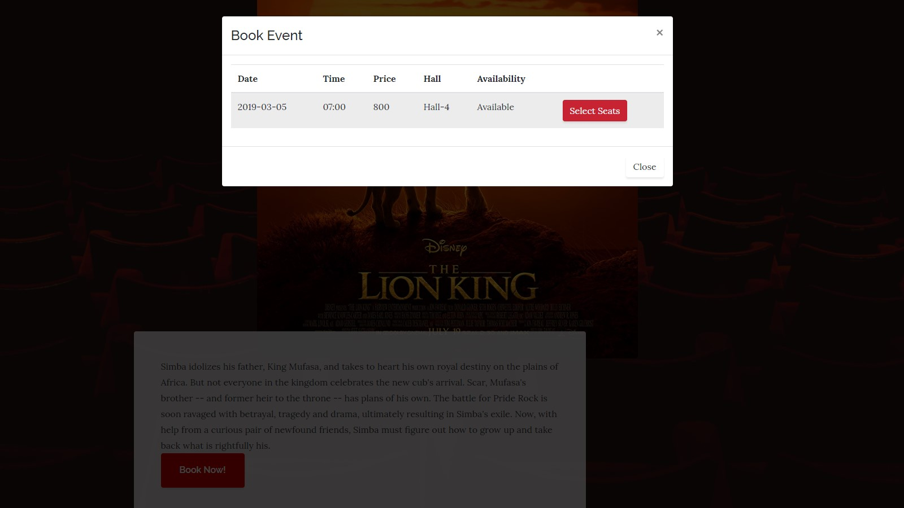

# The Arena Website
A three-page website designed for The Arena, a Pakistani 3D Cinema. The web design includes a homepage (home.html), a page to view movies' schedule (schedule.html), and a theatre seats selection page (SelectSeats.php).

## Homepage

## Schedule

## Booking

# Built With
* Bootstrap - Used to make the frontend responsive
* Font Awesome - The font and icon toolkit used

# Acknowledgments
* [Business Casual website theme by Blackrock Digital LLC](https://startbootstrap.com/template-overviews/business-casual/) - Used code from the template and modified it to create the cinema website design
* Hat tip to [Mashood Ur Rehman](https://github.com/LiteralWizard) for his contribution to the Select Seats page
